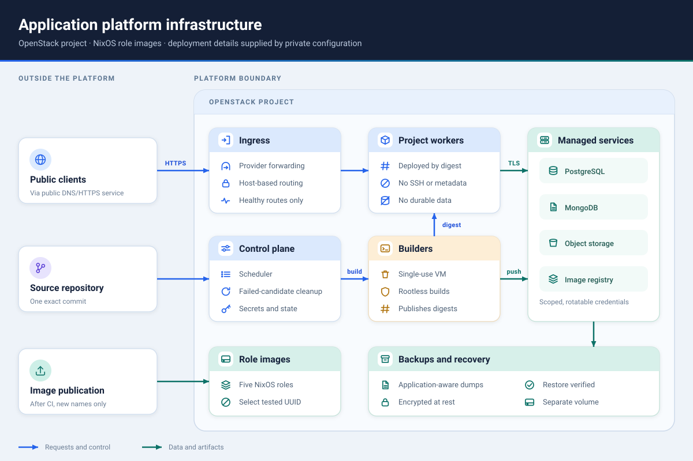

# A small application platform for OpenStack

Give each person or team a place to deploy a web application without giving
them cloud credentials or server access. Each application gets a stable HTTPS
URL, health-checked deployments, and optional managed data services.

For example:

- **A class** can give every student a personal project, create shared projects
  for team assignments, and keep databases running when application workers are
  replaced.
- **A hackathon or research group** can host many small applications in one
  OpenStack project while keeping infrastructure credentials with the
  organizers.

Applications can use managed PostgreSQL, MongoDB, and S3-compatible object
storage. The platform also runs a private image registry, encrypted backups,
restore checks, and health monitoring.

## Current status

The infrastructure and operator tools are implemented. The self-service portal,
production API, and turnkey installer are not. Operators currently run the
deployment tools directly, which is why the setup path below is explicit rather
than a single install command.

This repository is useful today if you want an operator-managed platform or a
base for your own control plane. It is not yet a ready-made service where end
users sign in and deploy applications themselves. The
[roadmap](docs/ROADMAP.md) tracks that work.

## What it provides

A deployment:

- builds an exact source commit in a single-use builder;
- publishes the resulting container image by immutable digest;
- runs each active application project on a dedicated, replaceable worker;
- routes public traffic only to healthy applications;
- keeps managed data separate from application workers;
- supports scoped, rotatable database and object-storage credentials;
- cleans up failed deployment candidates without rebuilding source; and
- takes encrypted backups of managed data and control-plane state, with
  restore verification.

Participants do not receive SSH keys, OpenStack or scheduler credentials,
registry credentials, or database administrator passwords.

Applications currently run as one OCI container, serve HTTP on one port, and
provide a health path. The current scheduler configuration runs one application
instance per project. Periodic managed-storage usage collection is not
implemented.

Every command acts only on the resources your configuration names, so unrelated
servers and volumes in the same OpenStack project are left alone.

## Set up your own deployment

The platform is not specific to any one institution or course. To run it on
your own OpenStack project:

1. [Getting started](docs/GETTING_STARTED.md) — check that the platform fits,
   create your private inventory and policy from the tracked examples, and
   build a role image.
2. [Image publication](docs/IMAGE_PUBLISHING.md) — publish role images locally,
   or configure the GitHub environment, secrets, and variable that let CI build
   and publish them for you.
3. [Tutorial](docs/TUTORIAL.md) — one complete pass from an empty project to a
   verified HTTPS application and a managed database, then cleanup.
4. [Operations](docs/OPERATIONS.md) — the ordered procedures for running the
   platform after that first deployment.

Your deployment inventory lives in `config/platform.json`, which is private and
untracked. `config/platform.example.json` is the tracked template that
documents every field; the [configuration reference](docs/CONFIGURATION.md)
explains what each one means.

## Designed to be extended

The platform is split into small role-specific services and narrow operator
commands. You can build a portal or API on top of those commands, choose a
different public DNS and HTTPS provider, change application and quota policy,
or add operator workflows without exposing unrestricted infrastructure access.

Cloudflare Tunnel is the reference public-ingress setup, but it is not required.
An institutional or managed ingress service can be used instead, provided it
meets the [public ingress contract](docs/PUBLIC_INGRESS.md). PostgreSQL,
MongoDB, and S3-compatible storage are included; additional managed services
can be added by implementing their provisioning, credential, health, backup,
and cleanup lifecycle.

## How it fits together

| Role | Responsibility |
| --- | --- |
| `admin` | Runs the scheduler control plane, constrained operator helper, and monitoring |
| `ingress` | Routes public requests to healthy applications |
| `storage` | Runs PostgreSQL, MongoDB, object storage, and the private image registry |
| `worker` | Runs one application project without durable local state |
| `builder` | Builds one source snapshot, then is deleted |

The [architecture guide](docs/ARCHITECTURE.md) explains the isolation, data, and
failure boundaries.

## Documentation

- [Getting started](docs/GETTING_STARTED.md) — requirements, configuration, and
  the first image build
- [Tutorial](docs/TUTORIAL.md) — one complete deployment, start to finish
- [Operations](docs/OPERATIONS.md) — deployment, backup, restore, and cleanup
  procedures
- [Troubleshooting](docs/TROUBLESHOOTING.md) — symptom, evidence, correction
- [Configuration reference](docs/CONFIGURATION.md) — every deployment setting
- [Image publication](docs/IMAGE_PUBLISHING.md) — local and CI publication
- [Public ingress](docs/PUBLIC_INGRESS.md) — provider-neutral DNS and HTTPS
  requirements
- [`openstack-platform` commands](docs/CONTROL_PLANE_CONTRACT.md) — the
  installed staff interface for infrastructure, applications, storage, and
  recovery
- [Documentation index](docs/README.md) — all guides and references

## License

Licensed under the [Apache License 2.0](LICENSE).
