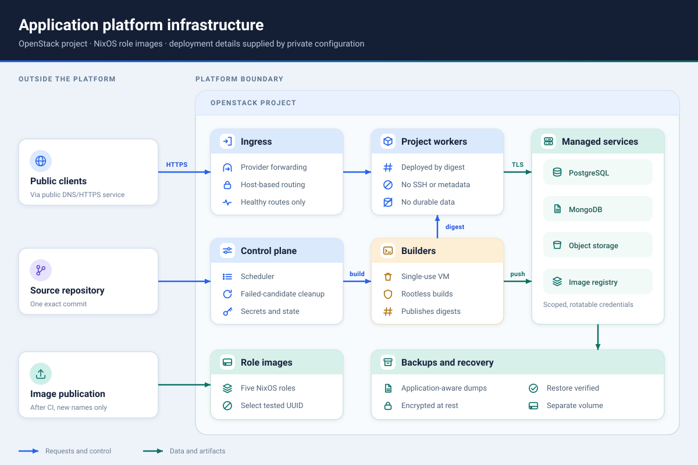

# Platform internals

This document is for maintainers building or integrating platform components.
It describes ownership, process boundaries, state, internal interfaces, and the
owner portal. Deployment operators should start with [Deploy
the platform](DEPLOYMENT.md); exact backup and recovery commands are in
[Operations](OPERATIONS.md).

## Shared configuration and contract

One private deployment inventory, `config/platform.json`, supplies project
identity, resource names, addresses, images, versions, volumes, paths, ingress,
and internal naming. Source-tree tools select it through `PLATFORM_CONFIG`; the
installed operator launcher pins
`/srv/openstack-platform/config/platform.json`; guests use the immutable
NixOS-provided `/etc/<namespace>/platform.json`.

The inventory is non-secret but private because it exposes deployment topology.
The separate mode-`0600` operator policy contains the standard worker/storage
profile, digest-pinned Node and Bun runtime images, and the public age recipient
for the two SQLite backup classes. Credentials, private PKI, age identities,
Nomad tokens, storage administrator credentials, and SSH private keys do not
belong in either file.

`infra/lib/platform_contract.json` is the canonical cross-language
implementation contract. It defines role sets, ports, service accounts,
executables, paths, protocols, and required inventory keys. Python consumes the
packaged projection through `openstack_platform.contracts`; standalone
infrastructure scripts use `infra/lib/platform_contract.py`; Nix imports it
through `nix/lib/constants.nix`; shell receives an allowlisted projection from
`infra/lib/platform_config.py`. Changing the contract is a coordinated release,
not a deployment edit.

The controller database identity hashes the OpenStack project UUID, namespace,
and stable inventory fields: network/address identity, resource names, volumes,
paths, and PKI naming. Image, flavor, version, checksum, and container changes
are excluded so ordinary upgrades do not strand state. A copied database from a
different stable identity is rejected.

## Roles and state ownership



| Role | Lifetime | Main responsibility | Durable state |
| --- | --- | --- | --- |
| `admin` | Persistent | Nomad control, controller, constrained helper, monitoring, backup staging | Controller/Nomad state and backup volume |
| `ingress` | Persistent | Public platform and healthy Nomad routing | None |
| `storage` | Persistent | PostgreSQL, MongoDB, Garage S3, and OCI registry | Managed-data volume |
| `worker` | Replaceable | One application's Nomad allocation | None |
| `builder` | Single use | Rootless BuildKit build from one source snapshot | None |

The admin-state volume contains hosted-controller SQLite, Nomad state,
operator-helper releases, and diagnostics. The storage volume contains managed
services and registry data. The backup volume contains encrypted logical
backups and committed verification evidence.

Persistent host replacement keeps the fixed port and retained volumes. It
creates a candidate host from the selected exact image UUID, verifies identity
and role readiness, and removes the old host only after acceptance. A failed
candidate returns to the old host; an ambiguous provider result is journaled as
recovery-required.

## Processes and trust boundaries

### Operator host

`openstack-platform` is the unprivileged infrastructure CLI. It owns greenfield
setup, infrastructure status, image selection/pruning, persistent-host
lifecycle, external operator-state backup, and offline restore. It has no
application, deployment, environment, or managed-storage mutation commands.
Its SQLite database is separate from the hosted controller database.

The operator reaches admin only through the generated `platform-admin` SSH
alias. That alias pins the address, `agentops` account, ED25519 host key,
identity file, strict checking, and forwarding restrictions. Provider calls use
the separately protected `platform-openstack` executable; releases do not carry
cloud credentials.

### Admin host

`openstack-platform-controller` runs as `platform-controller`. It owns product
records and lifecycle orchestration. It calls a fixed local helper rather than
holding broad OpenStack, Nomad, registry, or storage administrator interfaces in
the HTTP process.

`openstack-platform-helper` accepts one strict protocol-v1 JSON request. The
release-bound `openstack_platform/helper/actions-v1.txt` allowlist must exactly
match production handlers. Helper code performs application/Nomad operations,
managed-storage provider operations, and backup evidence acceptance. Request
input cannot select an executable, remote host, provider credential, or general
shell command.

### Controller sockets

The admin role exposes two mode-`0660` Unix sockets:

| Socket | Peer | Capability |
| --- | --- | --- |
| `/run/<namespace>-controller/project.sock` | `management-broker` UID/GID | Health, product routes and confirmed storage deletion |
| `/run/<namespace>-controller/privileged.sock` | Operator UID/GID | Administrator reads and cascade application deletion |

The server authenticates every connection with Linux `SO_PEERCRED` before
parsing HTTP. HTTP input cannot select or upgrade a socket capability. The
transport authenticates the local host process, not a browser user; ownership,
quota, session, and CSRF decisions belong to the management broker.

## Greenfield setup flow

`openstack_platform.setup` resolves setup input and checkpoints the operation.
At a high level it:

1. validates the clean full commit, signed component/artifact evidence, local
   tools, protected files, authenticated project, quota, names, and addresses;
2. generates private inventory, policy, SSH identities, service credentials,
   backup identity, and internal PKI;
3. reconciles security groups and reserves persistent fixed ports;
4. evaluates and builds each NixOS role, QEMU-boots the exact QCOW2 with a
   config drive, verifies signed artifact identity, and publishes to Glance;
5. creates admin, establishes host-key and SSH/provider bridges, and bootstraps
   Nomad ACLs;
6. creates storage and ingress, verifying exact serial readiness markers;
7. installs the matching operator and helper releases;
8. seeds all five accepted image UUIDs, then starts and verifies the hosted
   controller service, readiness unit, socket ownership/mode, peer restrictions,
   and hosted-controller backup timer;
9. records the same image UUIDs in operator state and initializes backup
   schedules; and
10. requires healthy aggregate status before reporting completion.

Setup is resumable because generated private material and provider mutations are
checkpointed and re-observed. Existing resources are reused only when their
full expected projection matches. There is no import or name-only adoption
phase.

## Application lifecycle

The implemented controller is used by the locally tested owner portal; that
browser product is not deployed yet. For a deployment request the controller:

1. validates the application UUID/slug, public credential-free GitHub URL,
   requested ref, exact commit, configuration revision, and closed typed
   configuration;
2. records an immutable deployment attempt and accepts the external operation
   under an idempotency key;
3. asks the helper to create a single-use builder;
4. acquires the exact source snapshot and transfers a generated recipe;
5. runs rootless BuildKit and records the pushed immutable OCI digest;
6. deletes and verifies the builder and its fixed port;
7. creates the application's dedicated worker, or verifies the exact accepted
   worker for an opt-in reuse deployment;
8. submits the generated Nomad job and candidate route;
9. accepts only after scheduler, application, and public-route health pass; and
10. removes a failed candidate with bounded cleanup while preserving the prior
    accepted route.

The repository supplies source and supported lockfiles only. Deployment
configuration is a caller-owned immutable snapshot. Node/Bun package paths and
script names are data, not shell command strings. Storage bindings map typed
resource outputs to runtime environment keys; they do not create or delete
storage.

Environment values and managed-service credentials live in owner-scoped Nomad
Variables. Controller SQLite records key names, owners, revisions, and
timestamps, never values. API reads never return values.

### Authoritative deployment reads and retained rollback

Application reads expose `activeDeploymentId` from the accepted pointer, not the
newest attempt. Deployment reads/history expose `configuration`, its canonical
`configurationSha256`, and `sourceRepository` alongside the exact commit and
artifact digest. Configuration contains build/runtime settings and storage
resource IDs/output-to-key bindings, not environment values. Source comes from
the matching deployment journal intent, never the application's mutable current
repository. Missing or inconsistent source evidence returns `null` and prevents
using that attempt as a rollback target.

Staff rollback requires a different, complete successful attempt for the same
enabled application. The review plan binds the current accepted deployment,
current environment revision, sizing, storage identities and historical artifact
and configuration. Apply compares that projection under the application lock
and rechecks current storage outputs and registry availability before candidate
creation. `app.manifest.verify` checks digest-addressed OCI/Docker manifests and
reachable blob availability using only GET/HEAD within the application's registry
repository; it does not rebuild or return registry content or credentials.

Rollback preserves current sizing and copies current secrets into the candidate's
workload variable. Derived platform values, including `PORT`, come from that
candidate's configuration rather than the shared variable. No environment
snapshot, database contents, storage objects, or worker filesystem is restored.
The shared health/promotion/acceptance path preserves the predecessor on candidate
failure. After acceptance, an existing optional FIP is handed over and verified
before predecessor cleanup; no FIP reservation is created by default. Interrupted
acceptance or cleanup resumes with the original request and idempotency key.
See [Roll back an application](OPERATIONS.md#roll-back-an-application).

### Retained worker primary ports

Migration 4 journals optional app-owned Neutron ports separately from disposable
worker slots. `app.worker.create`, `observe`, `capacity`, and single-slot `delete`
accept a closed `retainedPort` identity supplied by the controller, never a
caller-selected port name alone. Worker server metadata remains generation-scoped;
port name, description, UUID, network/subnet, security-group UUID, and IPv4 remain
reservation-scoped. Provider UUIDs may be canonical or compact lowercase; requests
and journal UUIDs must be canonical.

The Nix provider Python environment patches openstacksdk's security-group
`project_id` descriptor to alias legacy Neutron `tenant_id`, matching the SDK's
port/subnet behavior. OSC hides `tenant_id`; without the alias, tenant-only
responses lose ownership evidence. The package-scoped override applies to both
OSC and direct SDK consumers used by admin/helper launchers. It does not infer
ownership from credentials or repair an explicit null/wrong project. Provider
ownership validation remains strict. Nix `package-smoke` verifies the real CLI
against a loopback tenant-only response; adopting the fix requires a new admin
image, not a controller database migration.

Reservation alone does not alter the accepted generation. After bounded
predecessor absence, the controller journals `worker_slot_id` before the next
candidate uses the port. Only that slot receives the retained helper identity;
ordinary predecessors retain their original cleanup semantics. Rebinding checks
the former retained slot before changing this pointer, so post-acceptance cleanup
never mistakes the shared port's new attachment for the old worker's attachment.
An unbound retained port is positively validated but represented as worker
absence, not port-allocation absence. Nova receives an explicit existing primary
`--port` (not a newly allocated NIC); ordinary worker cleanup never deletes it.

All reservation/lifecycle mutations share the application lock. The controller
journals allocation and worker-create uncertainty before provider calls. Unknown
outcomes cannot authorize repeated creation or release; recovery requires exact
positive evidence. Release deletes only a proven unbound owned port. App deletion
releases after bounded worker cleanup. Fixed and floating reservations exclude
each other under that same lock. Retained-port deployment, resize, and rollback
require maintenance mode; normal/floating rolling behavior is unchanged. See
[retained primary IPv4 operations](OPERATIONS.md#retain-a-worker-primary-fixed-ipv4)
for the admin-image/schema upgrade boundary and request/recovery procedure.

## Operator CLI reference

Global syntax:

```text
openstack-platform [--platform-config PATH] [--state-directory PATH]
  [--policy PATH] COMMAND
```

Implemented commands:

```text
openstack-platform setup check --env-file PATH [--cloudflare-token-file PATH] [--json]
openstack-platform setup --env-file PATH [--workspace PATH]
  [--cloudflare-token-file PATH] --apply
openstack-platform status
openstack-platform dashboard [--socket PATH] [--interval SECONDS]
openstack-platform backup
openstack-platform restore BACKUP [--age-identity IDENTITY] --yes
openstack-platform infra list
openstack-platform infra image list
openstack-platform infra image set admin|ingress|storage|worker|builder IMAGE
openstack-platform infra image prune [--apply --yes]
openstack-platform infra logs admin|ingress|storage [--lines COUNT]
openstack-platform infra start admin|ingress|storage
openstack-platform infra stop admin|ingress|storage --yes
openstack-platform infra reboot admin|ingress|storage --yes
openstack-platform infra replace admin|ingress|storage --yes
```

`status` combines accepted state with bounded live observations. `APPS` and
`STORAGE` are aggregate controller counts; the CLI cannot list or mutate those
records. Image selection records exact provider UUID, source commit, and
compatibility identity. Pruning is plan-first and protects selected,
server-referenced, unfinished-operation, and retained-history images.

`dashboard` serves a read-only browser view until interrupted. It binds a
mode-`0600` Unix socket, by default `STATE_DIRECTORY/run/dashboard.sock` in a
mode-`0700` directory, and admits only peers with the operator's UID and
requests with a loopback `Host`. Every `--interval` seconds (30–900, default
60) one refresh gathers three sources:

- one pinned admin SSH session running a fixed reader that sends `GET` requests
  to `/v1/admin/capabilities`, `/images`, `/applications`, `/deployments` (the
  two newest 100-item pages), `/storage`, and `/operations` (the three newest
  pages) on the privileged socket, reads the platform-health timer snapshot,
  and runs `systemctl is-active` for the controller and readiness units;
- the operator-state `infra list` projection with a 20-second provider bound;
  and
- credential-free HTTPS probes of public ingress and of each enabled
  application's accepted health path, each bounded by a wall-clock timeout. A
  probe counts as serving only with that deployment's `X-Platform-Deployment`
  marker, or the application ID that jobs rendered without an explicit marker
  carry, matching deployment acceptance.

The reader never calls `/v1/admin/status` or `/v1/admin/hosts`, because both
hold the controller's shared API lock during live provider and helper
observations. A failed source, or a failed section of the admin read, keeps
its last successful records with their age. Apart from static assets and `GET /api/snapshot`, the only route is
`POST /api/refresh`, which wakes the next refresh at most every 10 seconds and
requires a same-origin custom header.

The installed restore launcher targets external operator state at
`/srv/openstack-platform/state/platform.sqlite3`. Its dedicated
`--replacement-state-directory` option supports an absent database in a
private drill directory. Restore contacts no provider or network service and
validates deployment identity, schema, SQLite integrity, foreign keys,
sidecars, and unfinished operations before atomic replacement.

CLI exits are `0` success, `1` safe operation failure, `2` usage/validation,
`3` conflict or recovery-required, `4` unavailable dependency, and `130`
interrupt. Unexpected failures expose a correlation ID and write a private,
bounded diagnostic.

## Controller HTTP transport

The controller speaks HTTP/1.1 JSON over Unix streams. Requests and responses
are limited to 1 MiB. The parser rejects chunked request bodies, duplicate JSON
keys, repeated length/idempotency headers, non-finite numbers, unknown mutation
fields, and unsupported media types.

The transport admits at most 64 connections globally and 16 per peer UID. The
Nix service further configures eight active connections for each accepted peer.
Excess connections receive retryable `503 CONNECTION_LIMIT` with
`Retry-After: 1`. Header, body, write, and idle deadlines are 5, 30, 5, and 15
seconds; one connection serves at most 100 requests. Shutdown closes admitted
sockets rather than waiting for stalled clients.

Every mutation requires a canonical lowercase UUID `Idempotency-Key`. Repeating
an identical request replays the recorded result. Reusing the key with changed
method, path, or body returns `409 IDEMPOTENCY_CONFLICT`.

Request fingerprint validation treats strictly parsed deployment configurations as
public metadata. Supported storage output names and validated environment targets
are represented as sorted `[output, target]` pairs in a validation copy, so
PostgreSQL `password` and S3 `secret_access_key` identifiers are accepted without
relaxing secret-key filtering elsewhere. Operation-ref filtering is unchanged.
The fingerprint still hashes the original canonical JSON bytes, preserving
identical-request replay and existing idempotency records; normalization does not
change hashes for requests admitted by an older controller. Requests previously
rejected before claiming a key have no prior operation to replay. The shared
validator covers both API admission and DeploymentService's repeated fingerprint.

Database-only application creation returns `201`. External mutations durably
reserve application scope and return `202` with an operation resource before
external work. Four workers execute at most 32 admitted running/queued
operations, serialized per application. Operation polling uses an independent,
query-only SQLite read snapshot and does not wait for the API handler lock held
by slow live observations. Other synchronous handlers still share that lock.

Started work with recorded domain intent interrupted by controller restart becomes
`recovery_required`, preserving its domain checkpoint. A dispatch interrupted
before any domain intent was recorded becomes a terminal unstarted failure.
The caller resumes recovery-required work by repeating the identical request and key. Request bodies
are not retained in the dispatch journal, so secret-bearing environment bodies
must be supplied again. A new key cannot bypass a recovery-required operation
on the same application. New storage dispatch/domain kinds agree; recovery
requires exact kind and scope matching without legacy-spelling compatibility.
Older malformed dispatches remain blocked and unchanged. A recorded build rejection
becomes terminal only after exact builder absence and authenticated build-tag absence; uncertain cleanup is retried
without rebuilding. No secret-bearing request payload is added to durable state.

Application route observations use the accepted deployment's configured health
path and exact route marker, not the application's root page. A response from a
different deployment cannot claim healthy status. Intentionally disabled apps
report stopped state without probing an allocation or public route expected to
be absent; missing accepted evidence or transport failures remain unknown.

### Project and privileged routes

Application, deployment, operation, and managed-resource IDs are canonical UUIDs.
OpenStack flavor IDs are opaque strings (for example `4200`), not UUIDs.
The project socket exposes these product routes. Cascade application deletion
is installed only on the privileged socket; storage deletion is a project
capability guarded by the portal admin role.

| Method and route | Purpose |
| --- | --- |
| `GET /v1/health` | Project-socket readiness |
| `POST /v1/applications` | Create a controller application from a slug |
| `GET /v1/applications/{id}` | Read one application, including a `requiresMaintenance` boolean for retained primary IPv4; no reservation/provider identifiers |
| `POST /v1/applications/{id}/enable` | Enable an accepted application |
| `POST /v1/applications/{id}/disable` | Disable an application |
| `POST /v1/applications/{id}/delete` | Privileged cascade deletion with slug confirmation |
| `POST /v1/applications/{id}/deployments` | Typed exact-commit deployment; optional boolean `maintenance` and reviewed object `plan`; accepted sizing is preserved when plan is absent; worker reuse remains operator-only |
| `GET /v1/applications/{id}/deployments` | List bounded deployment history |
| `GET /v1/deployments/{id}` | Read one deployment attempt |
| `GET /v1/deployments/{id}/build-log` | Read bounded retained build output |
| `GET /v1/applications/{id}/runtime-log` | Read bounded current runtime output |
| `GET /v1/applications/{id}/environment` | List environment names and metadata, never values |
| `PUT /v1/applications/{id}/environment/{key}` | Add or replace one value |
| `DELETE /v1/applications/{id}/environment/{key}` | Remove one caller-owned value |
| `POST /v1/applications/{id}/environment/import` | Strict dotenv import |
| `POST /v1/applications/{id}/storage` | Create PostgreSQL, MongoDB, or S3 storage |
| `GET /v1/applications/{id}/storage` | List bounded application storage |
| `GET /v1/storage/{id}` | Read one storage resource |
| `PATCH /v1/storage/{id}/label` | Change its display label |
| `POST /v1/storage/{id}/verify` | Verify provider identity and health |
| `POST /v1/storage/{id}/rotate` | Rotate scoped credentials |
| `DELETE /v1/storage/{id}` | Project deletion with machine-name confirmation and optional boolean S3 purge; the broker exposes this only to stepped-up local admins |
| `GET /v1/operations/{id}` | Poll an accepted mutation |

The privileged socket also exposes administrator views and operator-only sizing operations.
Sizing is plan-first and uses the same deployment admission, candidate health,
acceptance, and cleanup lifecycle. See [Size an application](OPERATIONS.md#size-an-application).

| Method and route | Purpose |
| --- | --- |
| `GET /v1/admin/status` | Aggregate accepted and live status |
| `GET /v1/admin/hosts` | Persistent-host observations |
| `GET /v1/admin/images` | Hosted role-image selection records |
| `POST /v1/admin/images/{role}/selection` | Compare-and-swap exact hosted role-image metadata after provider validation; only worker/builder affect hosted provisioning |
| `GET /v1/admin/applications` | Paginated global application list |
| `GET /v1/admin/applications/{id}/fixed-ip` | Reservation state; reserved ports include fresh exact attachment evidence; deployment operators only |
| `POST /v1/admin/applications/{id}/fixed-ip/plan` | Read-only primary-port plan with `{networkId, subnetId, address}`; availability unproven until reservation |
| `POST /v1/admin/applications/{id}/fixed-ip` | App-locked `{action:"reserve", networkId, subnetId, address}` or `{action:"release"}`; see [retained primary IPv4](OPERATIONS.md#retain-a-worker-primary-fixed-ipv4) |
| `GET /v1/admin/applications/{id}/public-ip` | Recorded optional outbound IPv4 reservation; deployment operators only |
| `POST /v1/admin/applications/{id}/public-ip/plan` | Read-only quota and routed-network capability check with `{externalNetworkId}` |
| `POST /v1/admin/applications/{id}/public-ip` | App-locked `allocate`, `attach`, `release`, or `reconcile`; see [public IPv4 operations](OPERATIONS.md#reserve-a-stable-outbound-ipv4) |
| `GET /v1/admin/applications/{id}/resize-plan` | Observe a sizing plan; requires one `flavor` query parameter |
| `POST /v1/admin/applications/{id}/resize` | Apply `{plan, confirmation}` to an accepted app, reusing its OCI artifact; disabled apps require predecessor absence and enable only after healthy acceptance |
| `GET /v1/admin/applications/{id}/rollback-plan` | Read-only retained-artifact plan; requires `deploymentId`, with optional `reuseWorker=true\|false` (default false) |
| `POST /v1/admin/applications/{id}/rollback` | Apply the exact `{plan, confirmation}` through candidate health and acceptance without a build |
| `GET /v1/admin/capabilities` | Controller API version and supported features: `maintenance-after-build-v1` and `reuse-worker-v1` |
| `POST /v1/admin/applications/{id}/deployments` | Replacement requires normal deployment fields and a reviewed sizing `plan`; optional boolean `maintenance` authorizes single-process cutover. Reuse instead requires `maintenance:true,reuseWorker:true` and forbids a sizing plan |
| `GET /v1/admin/operations/{id}` | Poll an operator mutation on the privileged socket |
| `GET /v1/admin/deployments` | Paginated global deployment list |
| `GET /v1/admin/storage` | Paginated global storage list |
| `GET /v1/admin/operations` | Paginated global operation list |

List pages default to 50 and accept 1–100. Runtime/build logs default to 200
lines; runtime accepts at most 1,000 and build reads are additionally bounded by
the configured byte limit.

Responses include JSON content type, `Cache-Control: no-store`, and a
correlation ID. Errors expose only a code, bounded safe summary, correlation ID,
retryability, and optional blocking operation ID. Provider payloads, stack
traces, secret values, and private operation references are not returned.

With `maintenance: true`, the accepted process stays enabled during the build
and artifact/storage preflight. Under the application lock, `maintenance.py`
journals the predecessor's accepted deployment, job hash/image, placement, server,
and port before removing it. In replacement mode, the worker must be absent
before any candidate is created. The accepted pointer changes only after healthy
acceptance. A retry uses the journaled stop checkpoint rather than stopping a
newly created candidate. The modes are part of the immutable request; neither
can be added to an existing key. The project socket cannot request them.

With `reuseWorker: true`, `worker_reuse.py` pins the actual existing image and
worker identity, preserves sizing, and rechecks readiness/capacity before stop.
The helper's exact-identity `app.stop` leaves a stopped Nomad job until terminal
client allocations are confirmed; empty evidence, desired-stop or lost allocations
are not proof. `app.worker.capacity` includes the allowlisted worker observation,
so each readiness/capacity validation needs only one provider lookup sequence.
For reuse, the controller derives the helper-only `acceptedServerId` from the
accepted deployment's recorded worker, not from deployment request fields. That
exact server must still be Nova `ACTIVE`, with freshly verified provider ownership,
port attachment, Nomad identity, eligibility, Docker health and capacity. The
helper can then report readiness without a historical console bootstrap marker,
which may have expired from Nova's bounded console buffer. Ordinary provisioning
and observations retain their bootstrap gate; create/delete/observe actions reject
`acceptedServerId`. Missing accepted identity, provider drift or failed live checks
still block reuse, including after predecessor stop. No new worker is provisioned
by this read mode.
New running-to-running operations select `direct_reuse` before building; only
journaled quiescence and stopped state authorize direct canonical routing and
`force_pull=false` for the digest-pinned image. Recovery preserves this choice;
older in-flight operations and already-stopped restorations keep their existing
preview/promotion rendering. Ordinary rolling jobs remain unchanged.
The controller journals quiescence before purging that job. Failed-candidate
cleanup also quiesces before purge and never deletes the reused worker. A failed
cutover leaves the accepted pointer intact and records the app stopped while
retaining its worker identity. Explicit disable still removes that worker.
Rollback plans with `reuseWorker=true` bind the worker identity and can restore
the stopped accepted artifact on the same worker. No provider create/delete or IP
handover is performed for reuse; OS/flavor changes remain explicit replacements.
See the [curl runbook](APPLICATION_DEPLOYMENTS.md#reuse-the-existing-worker-for-code-updates).

Renewing an unfinished operation's deadline also marks the new attempt `running`
and clears the previous safe error. Failure during that attempt records a new
`recovery_required` error instead of leaving stale status throughout recovery.

## SQLite and operation state

`openstack_platform/controller/database.py` owns schema creation, forward
migrations, deployment binding, applications, immutable deployment attempts,
active deployment pointers, environment metadata, managed resources, image
selection, slug tombstones, idempotency requests, external-operation journals,
and dispatch state.

Database calls are intentionally short. External work is coordinated in domain
services and uses operation checkpoints rather than a database transaction held
across provider calls. Per-application admission prevents two external
mutations from changing the same scope concurrently.

Provider observations are evidence, not accepted state. Reconciliation never
creates product records merely because a matching server, job, database, or
bucket exists. Unsupported prior schemas fail before migration or provider
mutation.

## Backup and recovery model

The deployment has three independent backup classes:

1. **Hosted controller:** the live controller SQLite database under admin state,
   encrypted on admin to `<paths.backups>/hosted-controller` with its private
   identity held off-platform.
2. **External operator state:** the operator CLI SQLite database, backed up
   locally with SQLite's online API and encrypted to
   `<paths.backups>/controller`.
3. **Managed data:** encrypted PostgreSQL, MongoDB, Garage catalog/data, and
   retained OCI manifests/blobs under timestamped namespace directories.

Each accepted set uses ciphertext/data, checksums, and a final manifest as its
commit marker. Managed restore verification uses disposable PostgreSQL and
MongoDB containers and validates Garage/OCI archives before writing
`RESTORE-MANIFEST`.

Off-site export chooses only committed sets, verifies every copy, writes an
append-only canonical manifest, and updates a credential-free health receipt.
The destination must be a distinct mounted filesystem and provider retention is
operator-owned. Full-loss recovery restores both SQLite databases and managed
data into explicit replacement targets; it does not depend on GitHub or the
original registry because retained OCI artifacts are included.

## Network and workload isolation

Tunnel ingress binds Traefik to loopback and opens no public origin port. Direct
ingress applies one canonical provider IPv4 set to Neutron, the NixOS firewall,
and trusted forwarded headers. In both modes the external provider terminates
browser HTTPS and preserves `Host`.

Builders deny cloud metadata, use a dedicated unprivileged SSH identity from
admin, run rootless BuildKit, have registry push access only for their task, and
expire. Workers have no SSH service, deny metadata, accept application traffic
only from ingress, and run generated Nomad jobs with no privileged container or
host-volume option. Runtime credentials are scoped to one application and
injected through Nomad Variables.

The internal CA authenticates retained role/service relationships. Its private
material and deployment credentials are supplied after image build and are not
stored in public source or the Nix store.

## Owner portal

The Python broker/web/identity services and React/TypeScript UI are implemented,
with local controller/Commons doubles, release artifacts and installer checks.
The portal is not deployed; live sign-in and platform acceptance remain separate.

```text
browser -> HTTPS ingress -> management-web -> broker.sock -> management-broker
                                                      | -> controller project.sock
                                                      | -> identity.sock -> management-identity -> HTTPS Commons
operator-side privileged client -------------------------> controller privileged.sock
```

The read-only operator dashboard (`openstack-platform dashboard`) is an
operator-side privileged client, not this management application. It runs as
the operator, reads privileged administrator routes through the pinned alias,
serves only the operator's private Unix socket, and has no accounts, sessions,
or mutation routes.

Socket SO_PEERCRED authenticates the local host process, not a browser user.
Web owns no authoritative state and cannot reach identity/controller sockets or
broker SQLite. Broker owns users, sessions, ownership, quota, intent journal and
audit; it remains network-denied and is the controller project peer. The fixed
identity service admits only broker and checks one configured Commons HTTPS
origin. Its network sandbox allows configured/default Cloudflare CIDRs and the
local resolver; broker/operator/controller state and PKI/secrets are inaccessible.

Commons bb78c5e accepts an exact username/password JSON credential check. Identity
uses verified system TLS, bounded connect/read/size limits, no redirects/proxies,
strict duplicate-free JSON, canonical UUID and exact fields. It drops email and
returns only stable subject, username and display name, or a typed opaque error.
Passwords remain transient in browser/web/broker/identity request memory and are
never stored, audited, logged or echoed. Only development can trust a loopback CA. Identity queues within a shared
three-second admission/connect deadline, with 64 outbound exchanges and 128
local request slots. Broker wants identity without requiring it; identity startup
failure leaves existing portal sessions available.
No class-app cookies/session or browser-relayed identity result is accepted.

Sign-in is same-origin JSON with an anonymous HMAC CSRF token and Strict binder
cookie. Sessions are opaque server-side records: __Host-/Secure/HttpOnly/Lax,
Path=/, no Domain, 8 h absolute and 30 min idle for owners. Mutations check exact Origin and
session CSRF. Password changes and Commons archiving do not end already issued
portal sessions; logout, local revocation, expiry and restore do. Per-address
admission and fixed 60-second failure budgets per exact username and address
bucket reduce abuse. Five failures block further checks from that bucket before
identity is contacted, including correct passwords, until the window expires.
Outstanding checks reserve budget so concurrency cannot bypass it. Other
addresses remain unaffected and rejections never extend the window. Users are individual invited class accounts,
identified by Commons origin and stable UUID rather than mutable username.

The owner API exposes only their own apps/config/deployments/build logs/intents,
environment names and storage resources,
returning 404 for another owner's IDs. Defaults are two apps and one external
mutation per owner, with local-admin quota overrides. Broker transactions reserve ownership
and quota and persist the intent plus a separate controller idempotency key before
calling project.sock. Unknown outcomes repeat that exact key/request; known 202
operations are polled. Only terminal confirmed/not_required cleanup settles an
intent; recovery-required/unknown cleanup holds it. Broker/controller do not share
a transaction. No ownership is inferred from a slug or reassigned by username.

The UI supports sign-in, my apps/quota/create, public repository/preferred branch,
typed Node/Bun settings, full-SHA review/deploy, observed status/health, history and
build logs. React assets are external static files under strict CSP; admin runs
Python only. The configuration page supports write-only environment edits and
one resource per storage type (`postgres`, `mongo`, `s3`) per app, including pending
creation intents. The controller allows multiple resource names per type; the
broker deliberately restricts owners to one. Enable/disable and runtime logs
remain later work. Storage deletion and global administrator reads remain
operator-only.

Broker resource responses are explicit projections: environment names/revision
and the controller's whole-environment updated timestamp; storage resource UUID,
type, label, status, created/verified times and output-to-environment defaults.
Provider IDs, connection strings and credential values are excluded. Environment
values pass directly to project.sock; only names, actions and request fingerprints
are persisted in broker intents/audit. They are never included in portal errors or
logs. Value-bearing environment request fingerprints use HMAC-SHA256 with a
subkey derived from the private, crash-durable `anonymous.key` using
`owner-portal/env-fingerprint/v1` as the domain separator. A broker DB copy or
backup does not contain the key or a plain value/request digest for offline
value guessing. Non-secret fingerprints, including environment deletion,
storage and configuration, retain their existing SHA-256 format.

Accepted edits are polled without values. A lost environment admission or
controller recovery requires resubmitting the original key and value because
neither journal stores the body. Such intents are excluded from automatic replay;
they cannot starve background recovery of other operations. Environment writes
are limited to 30 new intents per owner per minute and 65,536 UTF-8 bytes per
value; controller admission also enforces the installed deployment's limits.

Portal defaults expose every output in `OUTPUT_ENVIRONMENT_KEYS`, including
PostgreSQL `password` and S3 `secret_access_key`. Strict controller fingerprint
normalization validates those identifiers as public binding metadata. Targets
remain owner-chosen, and credential values stay in Nomad Variables. PostgreSQL's
URL already includes its password. The public `SECRET_KEY_PATTERN` contract and
its parity test against the controller's unchanged regex remain available;
the broker no longer applies a blocked-output filter.

Controller admission error codes are retained in existing intent JSON and
validated as 1–64 uppercase ASCII letters/digits/underscores, beginning with a
letter. No controller summary is retained or displayed. Admin/staff intent and
operation projections expose `controllerErrorCode`; owner projections strip it
and show release-owned guidance or a generic error. Already failed intents cannot recover a code that
was discarded by an earlier broker version.
Known failed-deploy codes map to fixed release-owned guidance for root
`package.json`, per-package runtime lockfiles and root build/start scripts, or a
small HTTP-2xx health endpoint with a body of at most 4096 bytes. The
`build_rejected` phase also identifies build guidance. Deadline codes get health
guidance only when their recorded phase identifies health verification; unknown
failures keep the generic message. Owner projections omit internal codes while
showing the same guidance; staff/admin views retain the bounded code separately.
Controller free text is never used to select or populate guidance.

Saving bindings checks application ownership, outputs for the storage type,
valid/unreserved/injective targets and collisions with owner environment names
or pending edits. The broker serializes binding saves and environment admission
in SQLite transactions. Storage create/verify/rotate use durable, same-key intent
reconciliation; the portal shows progress until terminal controller evidence.
Environment edits restart and health-check running apps immediately. Binding
changes and credential rotation require a deploy, whose review lists injected
names only. The overview compares saved revisions and completed rotations with
the accepted deployment.

Owner resources originally shipped as protocol-2 release additions. The current
account model uses a matched protocol-3/schema-3 pair and approved admin image
replacement; the resource projections and keyed fingerprints remain unchanged.

### Local-admin application authority

The closed `/api/v1/admin-apps` namespace maps to broker `/v1/admin-apps` routes,
never controller `/v1/admin/*`. Owner and staff roles are denied before looking
up an app or contacting the controller. Admin GETs require Origin checks and a
session CSRF token; writes require the exact portal Origin and CSRF. The role,
generation and enabled state are rechecked in the mutation transaction and after
controller reads. Request-local context variables prevent concurrent threads
from sharing elevated authority. The normal `/v1/apps` namespace still enforces
ownership for every role. Adoption always requires step-up. Reassignment is an
optimistic owner transition and requires step-up; all app mutations share a busy scope across actors.

`GET /v1/admin-apps` pages the broker DB, default 25 and maximum 50, without
controller fanout. Detail reads use project GET by known UUID. Administrative
reads use bounded per-account/address buckets (one read/s, burst ten per account;
two/s, burst twenty per address; two active per account, eight total; browser admin reads queue at two requests) and the
existing 30-day/2M-row read audit. Mutation intent bodies carry a server-only `_portalAdmin` marker, stripped before
controller dispatch and omitted from public intent serializers,
with safe entries in the admin action audit; credentials, values and controller
refs are excluded. A downgraded account cannot resume an admin intent. Accepted
operations continue to reconcile; unaccepted admin intents stop for review if
the actor loses admin authority.

Configuration/environment/storage handlers are the owner implementations from
`broker/api.py` and `broker/resources.py` reused behind admin authorization. The
environment fingerprint remains a domain-separated keyed HMAC. Intents store
names and the server-only admin marker, and controller metadata projections discard values and provider
credentials. Cross-owner build/runtime logs are not exposed through the admin app
namespace because they can contain values. Concurrent-operation and environment
rate limits charge the acting account, with an app-wide busy scope. App creation
uses a selected owner's quota; adoption and
reassignment retain existing apps even if their owner is over quota. Storage
deletion requires a five-minute password/TOTP proof, typed `slug type`, no saved
binding to that resource, app-scope admission, and a safe audit record.

Adoption POST takes `applicationId` and optional `ownerId` plus an idempotency
key. Project GET verifies the app, then GET of its active deployment supplies
strict repository/ref/configuration evidence. The broker checks IDs, revision,
configuration digest and active-ID stability, validates bindings and imports the
accepted revision. Missing/legacy snapshots require operator deployment first.
Controller GET exposes only a retained-IP maintenance boolean; provider IP and
reservation records stay privileged. Admin deploy accepts maintenance/plan,
while owner/staff deploy bodies reject those fields. Plan fields, types, known
current sizing and fingerprint are checked before the broker journals a request;
the controller validates against fresh cloud evidence at admission. Omitting a plan preserves
accepted sizing. Class-app consent matches public URL host with Commons origin and is enforced
server-side for adoption, reassignment, deploy, state and storage changes. Deploy
and storage consent also apply through ordinary owner routes regardless of role;
owners still have no stop route. Creating any local account or issuing any invite
requires step-up, including owner/staff accounts.

### Local identities, roles and admin enrollment

Commons credential checking remains the fixed HTTPS identity integration, with
stable `(issuer, subject)` identity and no persisted Commons passwords. Local
accounts have issuer `local`, immutable UUID subject, and a unique canonical
lowercase username. They store only salted password hashes and private TOTP
state in broker SQLite. Local and Commons names occupy separate namespaces.
`POST /auth/login` accepts `method=commons` (default) or `local`, password and
optional TOTP; client role claims are ignored. The broker assigns the current
DB role to an immutable session snapshot. Roles are `owner`, `staff`, `admin`;
SQL and broker checks allow admin only when issuer is local. Every session joins
current enabled/status/role/generation; security changes increment generation and
delete all sessions. Staff/admin inherit own-app owner rights, while staff
catalog endpoints remain metadata-only.

Local hashing uses `hashlib.scrypt`, `N=32768,r=8,p=3,dklen=64`, random 16-byte
salts, constant-time hash comparison and automatic upgrade after valid login.
Only bounded supported costs are accepted from stored hashes. Three nonqueued
hash slots separately serve anonymous local login/enrollment, known-device login,
and step-up from a live admin session. Neither anonymous nor known-device work
can occupy the step-up slot. Aggregate algorithm memory is roughly 96 MiB;
OpenSSL is capped at 48 MiB per call, and the unit has no explicit MemoryMax.
Validated-address budgets admit at most 12 attempts/minute per lane. Known-device
login also has a process-local account/generation budget of 12 attempts/minute
across all addresses and at most one in-flight request per account. Account
admission state expires after its 60-second window. These limits have independent
address/failure buckets from step-up, including recognized-browser options.
A previous local five-hash benchmark averaged 0.377 s/hash, about 159 verifications
per minute per lane before transport/provider overhead. Hardware and load change
throughput. Failed credential checks have a one-second minimum response duration
after hash-slot release; busy slots return 503 quickly. The known-account
in-flight reservation lasts through that response delay. Widespread anonymous
saturation may shed new browsers/enrollment, while admin step-up stays isolated.
The cost corresponds to the 32 MiB option in the
[OWASP scrypt guidance](https://cheatsheetseries.owasp.org/cheatsheets/Password_Storage_Cheat_Sheet.html#scrypt).
Passwords must have 12+ characters, at most 1024 UTF-8 bytes and exclude the
username case-insensitively. Neither passwords nor factors are logged.

TOTP follows [RFC 6238](https://www.rfc-editor.org/rfc/rfc6238): SHA-1, six digits,
30-second steps and a ±1-step window. A private 160-bit secret is exposed only on
first enrollment response, as text/otpauth URI; no external QR endpoint is used.
Accepted counters strictly increase. Admin sessions require a confirmed local
factor; local owner/staff factors are optional. Admin expiry is 1 h/15 min idle,
staff 1 h/10 min, capped by shorter owner policy. Sensitive account actions need
password plus fresh TOTP within five minutes. Password work occurs outside DB
locks; credentials, generation and budgets are rechecked in the commit transaction.

Wrong passwords consume a rolling per-account budget of 20 failures/hour across
all addresses. After exhaustion, an unrecognized device performs the standard
dummy hash and receives the same generic error as a wrong password or unknown
account. Only a current known-device cookie with an available device failure
reservation exempts this password budget; a live session
reserves capacity but does not exempt step-up from it. No unknown-name rows are
allocated and there is no global backoff-table limit to lock out real accounts.
Only a correct password can cause a TOTP failure: each failure starts an
account-wide 30-second exponential backoff (doubling to at most one hour), with
at most 10 failures in any rolling hour. Login and step-up share these records;
known-device cookies never bypass TOTP restrictions. Success resets the
exponential streak, preserving rolling windows so a success cannot reopen the
hourly guessing budget. Trusted generation changes and restore clear the records.

Successful local sign-in/enrollment issues `__Host-portal-device` over HTTPS,
HttpOnly, Secure, SameSite=Strict, Path=/, no Domain, expiring in 90 days. The
version-2 cookie carries user UUID, generation, expiry and a random 128-bit device
ID, signed using a domain-separated
HMAC key derived from the private broker key (`owner-portal/known-device/v1`).
It recognizes a browser and grants no account/session/role access by itself.
Malformed, forged, expired, other-account and old-generation cookies are treated
as unrecognized. Explicit logout clears the browser's device cookie; every
generation bump invalidates it. Version-1 cookies keep valid recognition and
known-login capacity, but have no device ID and fall under the durable account
password budget. A successful legacy login issues a version-2 cookie. Refresh
preserves an existing device ID instead of reopening its failure allowance.

Device IDs have a process-local rolling budget of 20 failed hashed credential
attempts/hour, shared between known-device login and step-up, across all addresses.
This includes password and factor failures and dummy-hash denials, but not requests
shed before hashing. Pending reservations count against the budget. Success does
not clear failures. Exhausted device budgets use the dummy path and generic error;
they never bypass account TOTP limits. Each account and device registry is bounded
at 4096 entries; live device failure windows are not evicted to reopen an exemption.
If device tracking is full, untracked devices lose the exemption and use the
account password budget. Device state expires when its one-hour failures lapse.
These admission/device registries reset on broker restart; the durable account
password and TOTP budgets remain. All new state is in memory: schema, compatibility,
controller privileges and Nix units are unchanged, so a matched portal release
needs no admin image change. Only loopback development HTTP uses a non-Secure development
cookie name. The browser neither reads the cookie nor stores it in JavaScript.

The operator creates a hash-only enrollment file under the existing broker-group
setgid release/config directory, atomically at 0640. Broker reads it through its
existing read-only sandbox path; no new network permission is needed. IDs are
consumed in the same transaction that starts enrollment. Invitations/resets are
72 h hashed single-use DB tokens tied to user generation. Enrollment is bound to
the anonymous browser binder, lasts ten minutes, and limits code confirmation to
five failures. Password-reset links with an existing factor count wrong start-phase
codes per link, reject after five failures, and verify the code before scrypt.
Finishing enrollment supplies step-up only if a fresh code was verified in that
finish request. Issuing a password reset clears the old hash; issuing a factor
reset clears the old secret. Reset targets become pending until enrollment
completes, including optional-MFA accounts, so they cannot fall back to password
only. Migration 3 sets the bootstrap fence to its application time; restoring an
older v1/v2 DB and upgrading cannot replay a still-present enrollment file.
Restore clears every session/token/handle, preserves roles, fences
pre-restore files and advances factor counters beyond the restore window.
The final schema-3 account migration preserves immutable migrations 1/2; old,
unpublished staff-grant prototype schema-3 checksums are intentionally refused.
Use fresh development state rather than silently rewriting a migration record.

Admin-only broker/browser endpoints are `/api/v1/accounts` (GET list/search,
POST local invitation), `/api/v1/accounts/{user}` (PATCH role/state/revoke/reset),
`/api/v1/accounts/{user}/quotas` (PUT limits), `/api/v1/account-audit` (GET safe
admin actions), and `/api/v1/reauthenticate` (POST password/TOTP step-up). They do
not proxy controller administrator routes. Anonymous `/auth/token-info`,
`/auth/enroll` and `/auth/enroll/finish` require exact Origin and binder CSRF.
Setup links carry secrets only in fragments and transient POST bodies.
Admin GETs also require session CSRF and same-origin metadata. Paging defaults
25/max 50; account search caps at 64 characters, escaped LIKE parameters.
Account mutations recheck admin authority in their DB transaction and audit
atomically. Quota changes do not modify ownership or provider resources.
See [bootstrap and recovery](OPERATIONS.md#bootstrap-or-recover-a-local-admin).

### Read-only course catalog

Only the following browser GET routes exist, mapping to broker paths after
removing `/api`:

| Route | Query fields | Visible data and source |
| --- | --- | --- |
| `/api/v1/staff/owners` | `limit`, `cursor` | Broker user ID, username, display name, local enabled flag; only accounts known to the portal. |
| `/api/v1/staff/owners/{owner}` | None | The same identity plus effective app/concurrent-deployment quota limits, used and reserved counts from broker quotas/apps/intents and inventory defaults. |
| `/api/v1/staff/apps` | `limit`, `cursor`, optional `ownerId` | Broker app/owner IDs, slug, lifecycle, saved revision, creation time, sanitized repository URL from the current saved configuration. Rejected create attempts remain visible; they do not consume app quota. |
| `/api/v1/staff/apps/{app}` | None | Catalog fields plus public URL, desired-running flag, accepted deployment ID/commit/time, coarse process/route health, observation time and stale flag, from one project API app read or its last validated cache. |
| `/api/v1/staff/apps/{app}/deployments` | `limit`, `cursor` | Per-app project API deployment IDs, app IDs, status, commit, settings revision, cleanup state and requested/updated/accepted/last-healthy times. |
| `/api/v1/staff/apps/{app}/deployments/{deployment}` | None | The same snapshot fields after checking both requested deployment ID and broker-known parent app association. |
| `/api/v1/staff/operations` | `limit`, `cursor`, optional `ownerId`/`applicationId` | Broker intent/app/owner IDs, kind/state, coarse stage, cleanup status, creation/update/status-observation time and fixed attention enum. Only broker create/save/deploy intents appear; no controller poll is triggered by this read. |

Repository/public URLs must be HTTPS, at most 512 characters, with no userinfo,
query, fragment or control characters; invalid values become null. Missing
commit/timestamp/revision evidence remains null. Health is healthy, unhealthy,
stopped or unknown; stale observations display unknown health. Unrecognized
phases/cleanup states map to unknown, never to success. Accepted state survives
an unavailable live observation. Staff cannot list the entire Commons directory,
operator-created apps absent from broker ownership, or operator-only operations.

Staff responses use separate recursive field allowlists (`broker/staff.py`),
never the broader owner serializers. Exclusions include subject/issuer/email and
other users' sessions, credentials/secrets, ref/branch, all other configuration,
environment names/values/revisions, storage identifiers/bindings/credentials,
all logs, raw intent bodies/keys, raw operation IDs/refs/scope/phase/errors/status
URLs, registry images/digests, worker/provider/IP/sizing/host/capacity records,
backups/recovery/install state and every privileged administrator payload.
Deployment UUIDs can coincide with operation UUIDs; they are allowed resource
identifiers and grant no controller capability.

The broker remains the existing project peer. Project API permits known-app,
known-deployment and known-operation reads but has no global application,
deployment or operation list. Global `/v1/admin/*` lists remain privileged;
the client and host sandbox reject them. Enumeration begins with the broker DB,
then known app IDs authorize fixed GET paths. App lists fetch no per-row health.
One staff request can perform at most one upstream read, and staff share one
upstream slot out of the existing four client slots. Per-app controller history
currently materializes all attempts before paging; staff history refresh is
manual and controller behavior/privileges are unchanged.

Staff pages use the same React app/shell, themes, feedback and presentation
components. Staff navigation covers owners, applications and operations; owner
navigation and mutation components do not mount in staff mode. Directory pages
refresh manually; detail/operation polling runs every 15 seconds while visible,
pauses in hidden tabs, and stops after repeated failures. Idle/absolute expiry,
logout and access loss cancel queries and clear private in-memory data/CSRF;
query caches are never persisted. All navigation uses the immutable session role.

All staff collections default to 25 records and cap at 50, with scoped UUID
cursors and indexed local keyset paging. Unknown/duplicate/empty query fields,
GET bodies and invalid IDs are rejected. Responses cap at 256 KiB. Fixed read
limits are 60/minute per user (burst 10), 120/minute per validated address bucket
(burst 20), two concurrent reads per user and eight globally. IPv6 addresses
share /64 buckets. Limiter state is bounded (100 users/4096 addresses) and
process-local; restart resets it. 429/503 responses carry a 30-second retry
delay. These bound cost/response volume, not eventual disclosure: a compromised
staff credential can enumerate the entire approved course metadata catalog and
also manage its own apps. It cannot widen owner
write scope. Commons password/archival changes still affect new logins only.

Successful staff reads recheck authorization and commit a private read audit
before sending data. Audit/dependency failure returns 503 without metadata;
revocation during an upstream call suppresses a result at the final check.
Already authorized/in-flight responses cannot be retracted. Recovery-console
quiescing supplies the incident cutover. Account management belongs to local admins; audit-cap maintenance and bootstrap
belong to [portal operations](OPERATIONS.md#owner-portal-operations).

Schema 3 preserves immutable migration-1/2 checksums and invalidates all sessions,
adding local credentials, immutable role/generation snapshots, single-use tokens,
indexed paging and private admin/read audits. No initial admin password exists. Unknown schemas/checksums/realms fail closed. Online SQLite snapshots are
age-encrypted as the fourth backup class. Four-class off-site bundles coexist with
legacy three-class evidence, and restore invalidates sessions/anonymous challenges
and deletes all account/enrollment tokens while preserving roles and incrementing
generations. Pre-restore enrollment files are fenced off by issuance time. Read audits retain 30 days with bounded daily pruning on read
traffic and a 2-million-row cap; cap/commit failure denies staff reads, while
owner APIs have no audit-cap authorization dependency. Shared DB/disk failure
can affect both kinds of access.

Restore removes `anonymous.key`; broker startup generates a new key. Existing
environment-write fingerprints are not rewritten. Repeating an identical edit
with its old request key then returns `IDEMPOTENCY_CONFLICT`, explaining the
possible key change and asking for a new request key. Accepted operations can
still be polled without a value. Unknown or recovery-required intents retain
their held application scope and need administrator reconciliation before a new
request can proceed; a key change does not bypass that guard.


Broker and web archives bind exact source commit, source tar, runtime files,
built web asset hashes/manifest, npm/Python locks, Node build version, SBOM,
provenance, schema and protocol compatibility. They share the helper release's
Ed25519/channel trust policy. Source hashes authenticate code, while signed
artifact evidence separately authenticates generated bytes. Trusted wheel/verifier,
archive bounds and compatibility are checked before candidate code executes.
Installation preserves setgid service groups, smokes before .complete/current,
keeps prior releases and activates only a matching broker/web pair, including
identity inside the broker release. See maintenance and operations for review,
upgrade and schema-aware rollback requirements.

## Failure invariants

Maintain these invariants when changing the implementation:

- A build or upload creates a candidate; role-specific live checks create
  acceptance.
- A provider name match is never enough to adopt, mutate, or delete a resource.
- An unavailable observation does not erase accepted state.
- Builder cleanup is required after success and failure.
- Candidate deployment failure preserves the prior accepted route.
- Worker deletion does not delete managed data or deployment history.
- Persistent replacement retains the prior server and volumes through candidate
  readiness.
- Unknown external results remain journaled and resumable under the same intent.
- Environment and managed-service values do not enter controller SQLite or API
  reads.
- Product mutation does not move into the operator CLI.
- Executable rollback, database restore, and provider-state recovery are
  separate operations.
