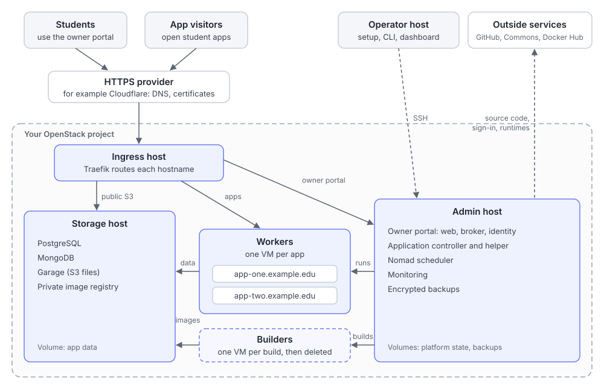

# How it works

This page explains the platform from the outside in: what the pieces are, what happens when a student deploys an app, where data lives, and how course staff keep it running. It assumes you know what a server, a container, and a database are, and nothing about this repository.

## The big picture

Everything runs inside one OpenStack project. OpenStack is open-source software for running your own cloud of virtual machines (VMs), much like a private AWS. Your school or lab may already run one.

The platform uses five kinds of virtual machine, called **roles**:

| Role | How many | What it does |
| --- | --- | --- |
| **Admin** | 1, permanent | The control center. Runs the application controller, the owner portal, Nomad (the scheduler that starts app containers), monitoring, and backups. |
| **Ingress** | 1, permanent | The front door. Runs Traefik, which sends each request to the right app or service by its hostname. |
| **Storage** | 1, permanent | Holds app data: PostgreSQL, MongoDB, Garage (an S3-compatible file store), and a private registry for app images. |
| **Worker** | 1 per app | Runs one app. No SSH or permanent disk; reused or replaced on deploys. |
| **Builder** | 1 per build | Builds one app image from one commit, then is deleted. |

Every machine runs NixOS, a Linux distribution whose entire configuration comes from code. Each role's disk image is built from one commit of this repository and boot-tested before it's used. Machines are never patched in place: to update one, you build a new image and replace the machine. [Hosts and images](guides/hosts-and-images.md) covers this.

Two things live outside the OpenStack project:

- **An HTTPS provider** such as Cloudflare. It owns your domain's DNS and certificates, terminates HTTPS, and forwards requests to the ingress host. With Cloudflare Tunnel, the ingress host doesn't need any public port at all.
- **The operator host**, an ordinary Linux account where course staff run setup and the `openstack-platform` command-line tool. It talks to the admin host over a pinned SSH connection.

## Addresses

With a domain like `example.edu`:

| Address | What's there |
| --- | --- |
| `https://example.edu` | The owner portal, where students manage their apps |
| `https://<app-name>.example.edu` | Each app, by the name its owner chose |
| `https://s3.example.edu` | Public S3 endpoint, for signed upload and download links |

## What happens when a student deploys

A student signs in to the owner portal, creates an app, enters its settings (repository, runtime, start script, port, health check path), and picks a commit. Then:

1. The **controller** on the admin host checks the request: a canonical GitHub URL, an exact commit, and settings of the expected types. It rejects caller-supplied shell commands and unknown settings, and uses a generated recipe rather than the repository's Dockerfile.
2. It asks its **helper** to create a fresh **builder** VM.
3. The helper fetches exactly that commit from GitHub, reads which Node.js or Bun version the repository asks for, and picks the official image for that version. It sends the source and a generated build recipe to the builder.
4. The builder installs packages from the lockfile, runs the build script if there is one, packages the app into a container image, and pushes it to the private registry on the storage host.
5. The builder is deleted.
6. The platform reuses a verified **worker** or starts a fresh one. Nomad runs the new image with the app's environment variables and database credentials.
7. The new version must pass Nomad, app, and public health checks before acceptance. Staged updates first use a preview route, then promote the route and check the app's public address again.
8. After acceptance, the old version and any replaced worker are removed. A failed ordinary deploy removes the new version and preserves the previous accepted version. Planned maintenance deploys stop the old version first; uncertain cleanup requires recovery ([command-line guide](guides/deploy-apps-from-the-command-line.md#choose-a-deployment-path)).

Builds and VM creation take time. Steps are recorded so the controller can reconcile interrupted work from evidence; uncertain outcomes stop for recovery.

## What happens when someone visits an app

1. The browser connects to the HTTPS provider at `https://<app-name>.example.edu`.
2. The provider forwards the request to the ingress host, keeping the original hostname.
3. Traefik on the ingress host looks up which worker serves that hostname and is healthy, and forwards the request.
4. The app answers. If it needs its database or files, it reaches the storage host on the private network.

Workers only accept app traffic from the ingress host and can't reach the cloud's metadata service. Each app receives only its own credentials.

## Where data lives

Each app can have one PostgreSQL database, one MongoDB database, and one S3 bucket. The owner chooses which environment variable names receive each connection detail. The storage host keeps all of it on one large volume.

Some things are deliberately not kept:

- **A worker's own disk.** It's discarded when the worker is replaced, so apps must keep durable data in their database or bucket.
- **Secret values in the controller's records.** Environment variables and database credentials live in Nomad's encrypted variables, scoped to one app. The controller records only their names, and nothing shows a value again after it's saved.

The admin host writes separate encrypted backup sets for controller state, portal state (accounts, ownership, audit log), deploy keys, and app data to its backup volume. Operator state is backed up on the operator host. Staff export the sets off site. [Backups and recovery](guides/backups-and-recovery.md) explains each set and how to restore it.

## Signing in

The owner portal has two kinds of accounts:

- **Class accounts through Commons.** Commons is a separate class website. When a student clicks **Sign in with your class account**, the portal sends them to Commons, Commons asks them to approve the portal once, and sends them back with a single-use code. The portal exchanges that code with Commons, server to server, for the student's identity. The portal never sees a Commons password.
- **Local accounts** that live only in the portal, with hashed passwords. Portal admins must be local accounts and must use an authenticator app (TOTP).

Each account has a role:

| Role | Can do |
| --- | --- |
| **Owner** | Create apps up to their quota, manage their own apps, add teammates |
| **Staff** | Everything an owner can, plus manage any app, with no app limit |
| **Portal admin** | Everything staff can, plus manage accounts, quotas, and the audit log; create, adopt, or reassign apps; delete storage; plan maintenance and resizing |

[Open the owner portal](guides/open-the-portal.md) and [Manage apps and people](guides/manage-apps-and-people.md) cover the details.

## How the pieces talk to each other

The parts are separated so that no single process holds every key:

- The **owner portal** is three services on the admin host. `management-web` serves the website and holds no state. `management-broker` owns accounts, sessions, app ownership, quotas, and the audit log, and is the only part of the portal that talks to the controller. `management-identity` is the only part that talks to Commons.
- The **controller** listens only on local Unix sockets, never on a network port. One socket is for the portal broker; another, with more power, is for the operator. The operating system checks which process is connecting before any request is read.
- The controller doesn't hold cloud or database admin credentials itself. It calls a fixed **helper** that can perform only an allowlisted set of actions.
- The **operator** reaches the admin host over SSH with a generated, pinned configuration, and uses the `openstack-platform` tool and the read-only operator dashboard from the operator host.

[Security](security.md) explains why each boundary is there, and the [internals reference](reference/internals.md) has the exact details.

## How the platform is built and updated

The repository is the single source of truth. To set up or update the platform:

1. A **release** records exactly which source commit and which built artifacts belong together, with a signature. [Releases and upgrades](guides/releases-and-upgrades.md) explains why and how.
2. The setup tool builds the five role images from that commit, boots each one in a local VM to check it, and uploads it to OpenStack.
3. An image becomes **accepted** only after a real machine boots from it and passes role-specific checks.
4. Persistent hosts are replaced rather than patched. The old host is stopped while its port and data volumes move to the replacement, and retained for rollback until checks pass. This causes an outage.

## What it doesn't do

The platform intentionally keeps the app contract small:

- Apps are Node.js or Bun web apps built from a GitHub repository with a committed lockfile. The platform ignores repository Dockerfiles and runs named package scripts through a generated build recipe.
- One instance per app, at `<app-name>.<domain>`. No custom domains or scaling.
- No shell access for students, and no way to export platform credentials.

## Next steps

- [Plan a deployment](guides/plan-a-deployment.md) if you're considering running it.
- [Security](security.md) for the trust model.
- [Documentation home](README.md) for everything else.
